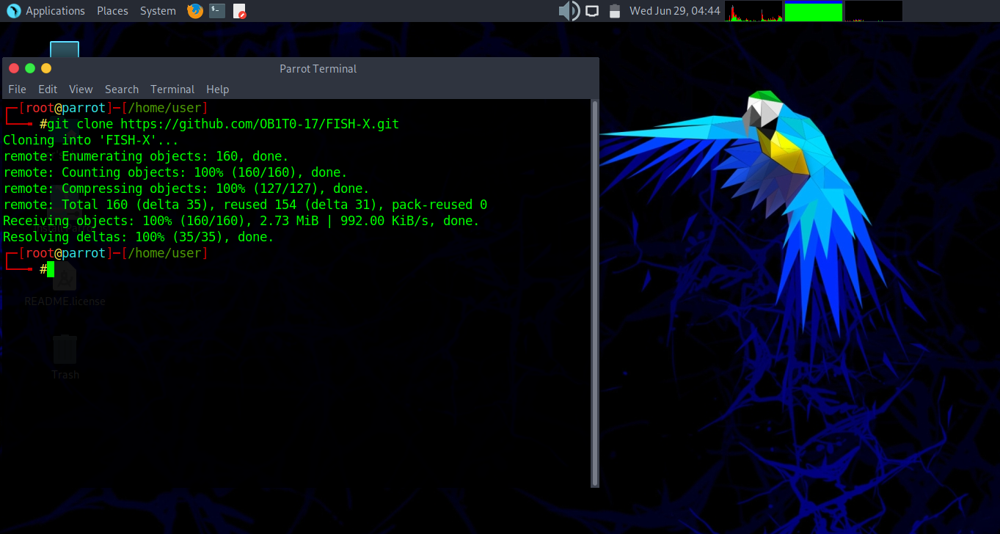
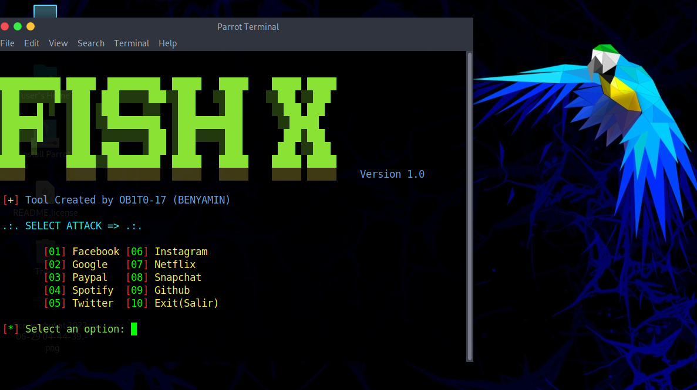

<p align="left">
</p>
<p align="center">
</p>
<p align="center">
<a href="#"></a>
</p>
<p align="center">
</p>

## Dependencies:

* `PHP`
* `CURL`
* `OPENSSH-SERVER`
* `GIT`

## Installation :

* `apt update`
* `apt install git curl php openssh-server -y`
* `git clone https://github.com/OB1T0-17/FISH-X.git`
* `cd FISH-X`
* `bash fish-x.sh`

## Single Command :
```
apt update 
```
```
apt install git curl php openssh-server -y
```
```
git clone https://github.com/OB1T0-17/FISH-X.git
```
<br>
<p align="center">
    
</p>

```
cd FISH-X
```
```
bash fish-x.sh
```
<br>
<p align="center">
    
</p>